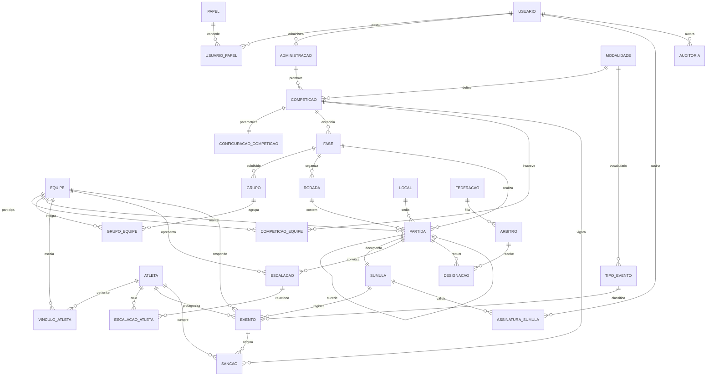

# MER / DER Definitivo

**Projeto:** Plataforma de gestão de competições esportivas amadoras
**Escopo:** modelo de dados canônico da plataforma — fonte única de verdade para o mapeamento JPA, as migrações de banco e o contrato de API.
**Vocabulário:** [`glossario.md`](glossario.md) · **Contrato HTTP:** [`padrao-api.md`](padrao-api.md)

---

## 1. Convenções

1. **Idioma:** PT-BR em tabelas, colunas e atributos, conforme o glossário.
2. **Chave primária:** toda tabela tem `id BIGINT`, gerado pelo banco (`IDENTITY`). Nenhuma chave é fornecida pelo cliente.
3. **Chave natural:** expressa como índice único, nunca como chave primária (ex.: `atleta.documento`, `modalidade.codigo`).
4. **Nomes de tabela:** singular (`competicao`, `partida`, `evento`). Tabelas associativas nomeiam os dois lados (`competicao_equipe`).
5. **Enumerados:** persistidos como texto em SCREAMING_SNAKE (`@Enumerated(EnumType.STRING)`), nunca por ordinal.
6. **Instantes:** `TIMESTAMP WITH TIME ZONE`, gravados em UTC.
7. **Exclusão:** lógica (`excluido_em`) em entidades com trilha de auditoria; física apenas em associativas.
8. **Derivados:** classificação, chaveamento e estatísticas **não são armazenados**. São calculados no servidor a partir de `evento` e `partida` (RNF23).

---

## 2. Diagrama Entidade-Relacionamento

> Leitura das cardinalidades: `||--o{` = um-para-muitos com lado fraco opcional; `||--||` = um-para-um obrigatório; `||--o|` = um-para-um opcional (auto-relacionamento de `PARTIDA`, usado no chaveamento).

---

## 3. Dicionário de Dados

### 3.1 Identidade e acesso

**`usuario`** — pessoa autenticável na plataforma.

| Coluna | Tipo | Restrição | Observação |
|---|---|---|---|
| `id` | BIGINT | PK, IDENTITY | |
| `nome` | VARCHAR(180) | NOT NULL | |
| `email` | VARCHAR(180) | NOT NULL, UNIQUE | credencial de login |
| `senha_hash` | VARCHAR(255) | NOT NULL | hash com sal; nunca trafega na API |
| `ativo` | BOOLEAN | NOT NULL, DEFAULT TRUE | desativação em vez de exclusão |
| `criado_em` | TIMESTAMPTZ | NOT NULL | |

**`papel`** — perfil de autorização (`ADMINISTRADOR`, `ORGANIZADOR`, `MESARIO`, `ARBITRO`, `REPRESENTANTE_EQUIPE`, `PUBLICO`).

| Coluna | Tipo | Restrição |
|---|---|---|
| `id` | BIGINT | PK, IDENTITY |
| `codigo` | VARCHAR(40) | NOT NULL, UNIQUE |
| `descricao` | VARCHAR(120) | NOT NULL |

**`usuario_papel`** — associativa. PK composta (`usuario_id`, `papel_id`, `administracao_id`): o papel é concedido **no escopo de uma administração**, permitindo que a mesma pessoa seja organizadora em uma liga e árbitra em outra. `administracao_id` nulo representa papel global.

### 3.2 Organização das competições

**`administracao`** — entidade organizadora (liga, associação, universidade).

| Coluna | Tipo | Restrição |
|---|---|---|
| `id` | BIGINT | PK, IDENTITY |
| `nome` | VARCHAR(180) | NOT NULL |
| `descricao` | VARCHAR(500) | |
| `responsavel_id` | BIGINT | FK → `usuario.id`, NOT NULL |
| `criado_em` | TIMESTAMPTZ | NOT NULL |

**`modalidade`** — catálogo de esportes. Substitui o enum fechado `EnumTipoEsporte`.

| Coluna | Tipo | Restrição | Observação |
|---|---|---|---|
| `id` | BIGINT | PK, IDENTITY | |
| `codigo` | VARCHAR(40) | NOT NULL, UNIQUE | `FUTEBOL_DE_CAMPO`, `FUTSAL`, `SOCIETY`, `VOLEIBOL`, `BASQUETE`, `HANDEBOL` |
| `nome` | VARCHAR(80) | NOT NULL | rótulo de exibição |
| `jogadores_em_quadra` | SMALLINT | NOT NULL | valida a escalação |
| `ativo` | BOOLEAN | NOT NULL, DEFAULT TRUE | |

**`tipo_evento`** — vocabulário de ocorrências por modalidade (`GOL`, `PONTO`, `CESTA_3`, `CARTAO_AMARELO`, `FALTA_TECNICA`, `SUBSTITUICAO`…). Permite que o registro da súmula seja específico do esporte sem ramificação no código.

| Coluna | Tipo | Restrição |
|---|---|---|
| `id` | BIGINT | PK, IDENTITY |
| `modalidade_id` | BIGINT | FK → `modalidade.id`, NOT NULL |
| `codigo` | VARCHAR(40) | NOT NULL; UNIQUE(`modalidade_id`,`codigo`) |
| `pontua` | BOOLEAN | NOT NULL — se soma ao placar |
| `valor_pontuacao` | SMALLINT | NOT NULL, DEFAULT 0 |
| `disciplinar` | BOOLEAN | NOT NULL — se alimenta contagem de sanção |

**`competicao`** — o certame. Resolve E03, E04, E05, E07.

| Coluna | Tipo | Restrição | Observação |
|---|---|---|---|
| `id` | BIGINT | PK, IDENTITY | |
| `administracao_id` | BIGINT | FK → `administracao.id`, NOT NULL | |
| `modalidade_id` | BIGINT | FK → `modalidade.id`, NOT NULL | **uma** modalidade por competição |
| `nome` | VARCHAR(180) | NOT NULL; UNIQUE(`administracao_id`,`nome`,`edicao`) | |
| `descricao` | VARCHAR(500) | | |
| `edicao` | VARCHAR(40) | NOT NULL | ex.: `2026` |
| `categoria` | VARCHAR(20) | NOT NULL | `MASCULINO`, `FEMININO`, `MISTO` |
| `estado` | VARCHAR(20) | NOT NULL | `RASCUNHO`, `EM_ANDAMENTO`, `ENCERRADA`, `CANCELADA` |
| `inicio` / `fim` | DATE | | período previsto |

Transições válidas de `estado`: `RASCUNHO → EM_ANDAMENTO → ENCERRADA`; `CANCELADA` alcançável a partir das duas primeiras. Nenhuma transição é reversível.

**`configuracao_competicao`** — regras parametrizáveis, uma por competição. Substitui `RegrasFut` / `RegrasBas` / `RegrasVol`.

| Coluna | Tipo | Observação |
|---|---|---|
| `competicao_id` | BIGINT | PK e FK → `competicao.id` |
| `pontos_vitoria` / `pontos_empate` / `pontos_derrota` | SMALLINT | NOT NULL |
| `criterios_desempate` | JSONB | lista **ordenada** de critérios (`SALDO_GOLS`, `CONFRONTO_DIRETO`, …) |
| `quantidade_periodos` / `duracao_periodo_min` | SMALLINT | estrutura do jogo |
| `limite_substituicoes` | SMALLINT | |
| `cartoes_amarelos_para_suspensao` | SMALLINT | dispara `sancao` automática |

### 3.3 Estrutura de disputa

**`fase`** — etapa com formato próprio. Substitui o booleano `mata_mata`.

| Coluna | Tipo | Restrição |
|---|---|---|
| `id` | BIGINT | PK, IDENTITY |
| `competicao_id` | BIGINT | FK → `competicao.id`, NOT NULL |
| `nome` | VARCHAR(80) | NOT NULL |
| `formato` | VARCHAR(20) | NOT NULL — `PONTOS_CORRIDOS`, `GRUPOS`, `ELIMINATORIA` |
| `ordem` | SMALLINT | NOT NULL; UNIQUE(`competicao_id`,`ordem`) — encadeamento |
| `classificados` | SMALLINT | quantos avançam à fase seguinte |

**`grupo`** e **`grupo_equipe`** — chaves apenas quando `fase.formato = GRUPOS`.

**`rodada`** — agrupamento temporal de partidas dentro de uma fase (`fase_id`, `numero`, `inicio`, `fim`); UNIQUE(`fase_id`,`numero`).

**`local`** — quadra, campo ou ginásio (`nome`, `endereco`), referenciado pela partida.

**`partida`** — o confronto. Resolve E12, E13, E15.

| Coluna | Tipo | Restrição | Observação |
|---|---|---|---|
| `id` | BIGINT | PK, IDENTITY | |
| `fase_id` | BIGINT | FK → `fase.id`, NOT NULL | |
| `rodada_id` | BIGINT | FK → `rodada.id` | nulo em eliminatória |
| `equipe_mandante_id` | BIGINT | FK → `equipe.id` | nulo enquanto o chaveamento não resolveu |
| `equipe_visitante_id` | BIGINT | FK → `equipe.id` | idem |
| `local_id` | BIGINT | FK → `local.id` | |
| `data_hora` | TIMESTAMPTZ | | agendamento (RF58) |
| `estado` | VARCHAR(20) | NOT NULL | `AGENDADA`, `EM_ANDAMENTO`, `ENCERRADA`, `CANCELADA` |
| `placar_mandante` / `placar_visitante` | SMALLINT | NOT NULL, DEFAULT 0 | **derivado de `evento`**, materializado para leitura |
| `equipe_vencedora_id` | BIGINT | FK → `equipe.id` | |
| `partida_sucessora_id` | BIGINT | FK → `partida.id` | destino do vencedor no chaveamento |
| `posicao_na_sucessora` | VARCHAR(10) | | `MANDANTE` / `VISITANTE` |

Restrição: `equipe_mandante_id <> equipe_visitante_id`.

O par (`partida_sucessora_id`, `posicao_na_sucessora`) persiste o que hoje vive apenas em memória em `TabelaCampeonato.vinculoSucessor` / `origensPartida`, e é o que torna a propagação automática do vencedor (RF98) reproduzível após reinício.

### 3.4 Equipes e atletas

**`equipe`** — `id`, `administracao_id`, `nome`, `modalidade_id`, `federacao_id` (opcional). UNIQUE(`administracao_id`,`nome`).

**`atleta`** — pessoa física. Resolve E09 e E11.

| Coluna | Tipo | Restrição | Observação |
|---|---|---|---|
| `id` | BIGINT | PK, IDENTITY | id numérico, não string |
| `nome` | VARCHAR(180) | NOT NULL | |
| `data_nascimento` | DATE | NOT NULL | substitui `idade` (RF36) |
| `documento` | VARCHAR(20) | NOT NULL, UNIQUE | impede inscrição duplicada |
| `foto_url` | VARCHAR(500) | | |

**`vinculo_atleta`** — elenco de uma equipe em uma competição: `equipe_id`, `atleta_id`, `competicao_id`, `numero_camisa`, `posicao`, `inicio`, `fim`. UNIQUE(`competicao_id`,`equipe_id`,`numero_camisa`) garante numeração única por elenco (RF45).

Estatísticas de atleta (gols, assistências, cartões) **não são colunas** — são agregações sobre `evento`.

### 3.5 Súmula e eventos

**`sumula`** — documento oficial da partida: `partida_id` (PK e FK, um-para-um), `estado` (`ABERTA`, `FECHADA`, `HOMOLOGADA`), `observacoes`, `fechada_em`.

**`escalacao`** / `escalacao_atleta` — relação de convocados por partida e equipe, com `condicao` (`TITULAR`, `RESERVA`) e `confirmada_em` (RF67, RF68). UNIQUE(`partida_id`,`equipe_id`).

**`evento`** — **o núcleo do modelo.** Cada ocorrência relevante vira uma linha; tudo o mais é derivado dela.

| Coluna | Tipo | Restrição | Observação |
|---|---|---|---|
| `id` | BIGINT | PK, IDENTITY | |
| `sumula_id` | BIGINT | FK → `sumula.id`, NOT NULL | |
| `tipo_evento_id` | BIGINT | FK → `tipo_evento.id`, NOT NULL | |
| `equipe_id` | BIGINT | FK → `equipe.id`, NOT NULL | |
| `atleta_id` | BIGINT | FK → `atleta.id` | nulo em evento de equipe |
| `atleta_relacionado_id` | BIGINT | FK → `atleta.id` | assistência, atleta que entra na substituição |
| `periodo` | SMALLINT | NOT NULL | 1º tempo, 2º tempo, prorrogação |
| `minuto` | SMALLINT | NOT NULL | |
| `cancelado` | BOOLEAN | NOT NULL, DEFAULT FALSE | correção sem apagar histórico (RF102) |
| `registrado_em` | TIMESTAMPTZ | NOT NULL | |

**`assinatura_sumula`** — validação por três partes (RF88): `sumula_id`, `usuario_id`, `papel_assinatura` (`ARBITRO`, `REPRESENTANTE_MANDANTE`, `REPRESENTANTE_VISITANTE`), `assinado_em`. UNIQUE(`sumula_id`,`papel_assinatura`). A súmula só transita para `HOMOLOGADA` com as três linhas presentes.

**`sancao`** — suspensão derivada de eventos disciplinares: `atleta_id`, `competicao_id`, `evento_origem_id`, `motivo` (`CARTAO_VERMELHO`, `ACUMULO_CARTOES`), `partidas_suspensao`, `partidas_cumpridas`, `estado` (`ATIVA`, `CUMPRIDA`, `ANULADA`). Um atleta com sanção `ATIVA` não pode entrar em `escalacao_atleta`.

### 3.6 Arbitragem e auditoria

**`federacao`** — `id`, `nome`. **`arbitro`** — `id`, `usuario_id`, `federacao_id`, `categoria`.

**`designacao`** — árbitro escalado para uma partida com função (`ARBITRO_PRINCIPAL`, `AUXILIAR`, `MESARIO`). UNIQUE(`partida_id`,`arbitro_id`,`funcao`). O contador `partidas_apitadas` deixa de ser coluna e passa a ser contagem sobre esta tabela.

**`auditoria`** — trilha de alterações (RF136): `entidade`, `entidade_id`, `operacao`, `usuario_id`, `valor_anterior` (JSONB), `valor_novo` (JSONB), `ocorrido_em`. Obrigatória em qualquer alteração de partida já encerrada.

---

## 4. Do modelo atual para o canônico

| Hoje | No modelo canônico | Natureza da mudança |
|---|---|---|
| `Campeonato` | `administracao` + `competicao` + `configuracao_competicao` | decomposição |
| `Campeonato.mataMata` | `fase.formato` | booleano → entidade encadeável |
| `Campeonato.lstEnumTipoEsporte` (lista) | `competicao.modalidade_id` (único) | cardinalidade corrigida |
| `EnumTipoEsporte` (3 valores) | `modalidade` (6 registros) | enum → entidade |
| `Time` | `equipe` | renomeação |
| `Jogadores` | `atleta` + `vinculo_atleta` | separação pessoa × vínculo |
| `Jogadores.idade` | `atleta.data_nascimento` | derivado → fato |
| `Jogadores.gols/cartoes/…` | agregação sobre `evento` | coluna → derivado |
| `Partida.idTabela`, `Tabela` | `fase` + `rodada` | substituição |
| `Sumula.ocorrencias List<String>` | `evento` | texto livre → estrutura |
| `Sumula.assinada` (booleano) | `assinatura_sumula` (3 linhas) | booleano → entidade |
| `Jogadores.expulso` | `sancao` | estado solto → ciclo de vida |
| `Arbitro.partidasApitadas` | contagem sobre `designacao` | coluna → derivado |
| `TabelaCampeonato` (em memória) | `partida.partida_sucessora_id` + serviço de classificação | memória → persistência |

---

## 5. Sequência de implementação

O modelo acima é o destino, não uma migração única. A ordem que respeita as dependências de chave estrangeira:

1. `modalidade` e `tipo_evento` — sem dependências, desbloqueiam `competicao` e `evento`.
2. `usuario`, `papel`, `usuario_papel`, `administracao`.
3. `competicao`, `configuracao_competicao`, `equipe`, `atleta`, `vinculo_atleta`.
4. `fase`, `grupo`, `rodada`, `local`, `partida`.
5. `sumula`, `escalacao`, `evento`, `assinatura_sumula`.
6. `arbitro`, `designacao`, `sancao`, `auditoria`.
